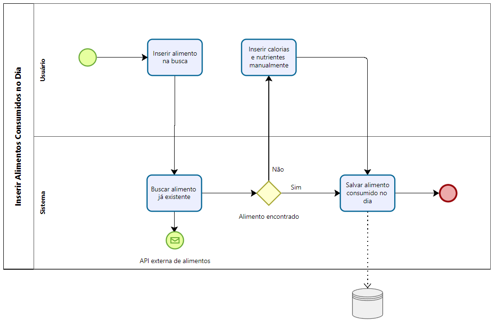

# Especificações do Projeto

Os pontos mais relevantes a serem tratados neste projeto foram abordados e exemplificados através de personas fictícias e suas respectivas histórias, expondo casos comuns dos problemas levantados na pesquisa, que foram elaborados a partir do conhecimento comum e vivência dos membros da equipe.

## Personas

|<h3>**Karem**</h3> |  ||
| ------------------------------------------------------- | -------------------| ---------|
|| **Idade:** 63 | “Quero uma alimentação saudável e balanceada com exercícios.” |
**Motivação:**  Deseja ter uma dieta com relação a suas condições físicas e idade.| **Frustrações:**  Não possuir conhecimentos em relação a nutrição e a idade elevada para atividades físicas. |  **História:** Sou uma senhora que realiza atividades físicas para manter a saúde e necessito de uma boa alimentação para me auxiliar nesta rotina.
| |  |  |

|<h3>**Chris**</h3> |  ||
| ------------------------------------------------------- | -------------------| ---------|
|| **Idade:** 32 | “Quero uma forma de controlar os treinos, rotina, alimentação e dados corporais.” |
**Motivação:**  Deseja ter uma aplicação para faciliar sua rotina de treinos.| **Frustrações:**  Não possuir organização e falta de tempo para o controle. |  **História:** Sou um atleta de alto nível e por este motivo necessito de ferramentas profisionais para controlar a rotina e auxiliar no dia a dia.
| |  |  |

|<h3>**Bob**</h3> |  ||
| ------------------------------------------------------- | -------------------| ---------|
|| **Idade:** 28| “Preciso de um aplicativo e site web para auxilar com meus alunos.” |
**Motivação:**  Deseja ter uma aplicação para aumentar a precisão e controle para seus alunos com acompanhamento de treino, exercícios e alimentação e informações corporais.| **Frustrações:**  Não possuir ferramentas ou modos de dar um melhor auxílio para seus alunos de forma digital e tecnológica. |  **História:** Sou um personal trainer e estou passando por problemas por não conseguir acompanhar e dar ajuda para meus alunos de forma digital.
| |  |  |

## Histórias de Usuários

|EU COMO| QUERO/PRECISO | PARA |
| ----------------- | -------------- | ----------- |
|Karem| Quero uma alimentação de calorias balanceada para minhas caracteristicas físicas | ter uma dieta especifica para meu físico |
|Karem| Quero poder cadastrar e registrar minha alimentação diária | Ter um registro das calorias e alimentos de forma diária. |
|Chris| Ter uma aplicação para definir uma rotina de exercícios para o dia a dia. | Conseguir ter organização e tempo para o controle das atividades físicas.|
|Chris| Poder marcar as atividades já realizadas e poder verificar com facilidade as atividades faltantes. | Conseguir ter organização e controle das atividades físicas.|
|Chris| Poder ter um histórico e retrospectiva de toda a rotina de treino. | Conseguir ter organização e mémorias dos treinos já feitos.|
|Bob| Quero uma aplicação para auxiliar meus alunos |Poder ajudar e acompanhar meus alunos de forma digital.|
|Bob| Preciso me comunicar com meus alunos de forma digital |Poder ter fácil comunicão com os alunos.|
|Bob| Desejo ter uma forma de comunicar os meus horários para os alunos |Poder ter fácil comunicão dos horários para os alunos e desta forma ter melhor organização.|
|Bob| Desejo ter uma forma de difinir as metas para os alunos de forma digital |Poder ter fácil controle e envio das metas de treino e rotina para os alunos.|

## Modelagem do Processo de Negócio 

Os processos abaixo descrevem a ordem de execução lógica de cada função do sistema.

#### Autenticação de usuário
Abrange todos os requisitos.

#### Inserir e Atualizar Características Físicas
Abrange os requisitos: RF-001.

#### Inserir Alimentos Consumidos no Dia
Abrange o requisito: RF-002, RF-005, RF-006.

#### Registrar um Modelo de Metas de Exercícios do Dia
Abrange os requisitos: RF-003.

#### Inserir Metas de Exercícios do Dia
Abrange os requisitos: RF-003, RF-004 RF-005.

#### Marcar como 'Concluída' cada Meta do Dia
Abrange os requisitos: RF-004, RF-005.

#### Visualizar um Panorama Geral de Progresso
Abrange os requisitos: RF-006.

#### Vincular com uma Academia
Abrange os requisitos: RF-007, RF-008, RF-009, RF-010.

<!--
## Indicadores de Desempenho
#### Data/Tempo postagem

#### Data/Pessoas simultâneas

#### Contagem Avaliações

#### Data/Receitas Postadas

#### Indicar público masculino / feminino

-->

## Requisitos

As tabelas que se seguem apresentam os requisitos funcionais e não funcionais que detalham o escopo do projeto.

### Requisitos Funcionais

|ID    | Descrição do Requisito  | Prioridade |
|------|-----------------------------------------|----|
|RF-001| A aplicação deverá recomendar automaticamente uma quantidade de calorias baseada nas características físicas e objetivo do usuário. | ALTA |
|RF-002| A aplicação deverá permitir que o usuário insira os alimentos que consumiu naquele dia, bem como seus nutrientes e calorias. | ALTA |
|RF-003| A aplicação deverá permitir que o usuário defina metas de exercícios para o dia. | ALTA |
|RF-004| A aplicação deverá permitir que o usuário marque como 'Concluído' cada um dos exercícios que colocou como meta. | MÉDIA |
|RF-005| A aplicação deverá permitir que o usuário veja em retrospecto seu registro diário para dias anteriores. | MÉDIA |
|RF-006| A aplicação deverá exibir uma síntese com base nos dados de cada dia, permitindo assim uma visão analítica para o usuário. | MÉDIA |
|RF-007| A aplicação deverá permitir que o usuário se víncule a uma academia, tendo novas interações disponíveis a partir disso. | BAIXA |
|RF-008| A aplicação deverá permitir que o usuário, vinculado à academia, veja comunicados da academia. | BAIXA |
|RF-009| A aplicação deverá permitir que o usuário, vinculado à academia, veja o horário dos instrutores. | BAIXA |
|RF-010| A aplicação deverá permitir que o usuário, vinculado à academia, tenha suas metas diárias definidas pelo seu instrutor. | BAIXA |

### Requisitos não Funcionais

|ID     | Descrição do Requisito  |Prioridade |
|-------|-------------------------|----|
|RNF-001| A aplicação deve ser compatível com sistemas Android e iOS | ALTA |
|RNF-002| A aplicação deve ser compatível com os principais navegadores Web | ALTA |
|RNF-003| O projeto deverá ser implementado com um banco de dados NoSQL. | ALTA |
|RNF-004| A aplicação deve possuir interface intuitiva. | MÉDIA |

## Restrições

As questões que limitam a execução desse projeto e que se configuram como obrigações claras para o desenvolvimento do projeto em questão são apresentadas na tabela a seguir

|ID| Restrição                                             |
|--|-------------------------------------------------------|
|01| O projeto deverá ser entregue até o final do semestre |
|02| Só poderão ser utilizados programas gratuitos ou fornecidos pela PUC Minas |

## Diagrama de Casos de Uso

Os casos de uso mostrando os Requisitos Funcionais para a aplicação são ilustrados abaixo.

# Matriz de Rastreabilidade

A matriz de rastreabilidade é uma ferramenta usada para facilitar a visualização dos relacionamento entre requisitos e outros artefatos ou objetos, permitindo a rastreabilidade entre os requisitos e os objetivos de negócio. 

# Gerenciamento de Projeto

De acordo com o PMBoK v6 as dez áreas que constituem os pilares para gerenciar projetos, e que caracterizam a multidisciplinaridade envolvida, são: Integração, Escopo, Cronograma (Tempo), Custos, Qualidade, Recursos, Comunicações, Riscos, Aquisições, Partes Interessadas. Para desenvolver projetos um profissional deve se preocupar em gerenciar todas essas dez áreas. Elas se complementam e se relacionam, de tal forma que não se deve apenas examinar uma área de forma estanque. É preciso considerar, por exemplo, que as áreas de Escopo, Cronograma e Custos estão muito relacionadas. Assim, se eu amplio o escopo de um projeto eu posso afetar seu cronograma e seus custos.

## Gerenciamento de Tempo

Com diagramas bem organizados que permitem gerenciar o tempo nos projetos, o gerente de projetos agenda e coordena tarefas dentro de um projeto para estimar o tempo necessário de conclusão.

O gráfico de Gantt ou diagrama de Gantt também é uma ferramenta visual utilizada para controlar e gerenciar o cronograma de atividades de um projeto. Com ele, é possível listar tudo que precisa ser feito para colocar o projeto em prática, dividir em atividades e estimar o tempo necessário para executá-las.

## Gerenciamento de Equipe

O gerenciamento adequado de tarefas contribuirá para que o projeto alcance altos níveis de produtividade. Por isso, é fundamental que ocorra a gestão de tarefas e de pessoas, de modo que os times envolvidos no projeto possam ser facilmente gerenciados. 

## Gestão de Orçamento

O processo de determinar o orçamento do projeto é uma tarefa que depende, além dos produtos (saídas) dos processos anteriores do gerenciamento de custos, também de produtos oferecidos por outros processos de gerenciamento, como o escopo e o tempo.

