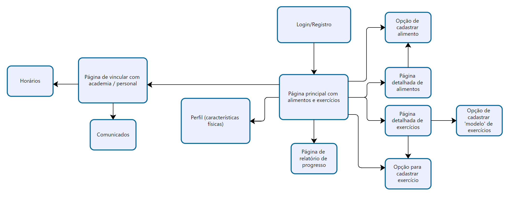
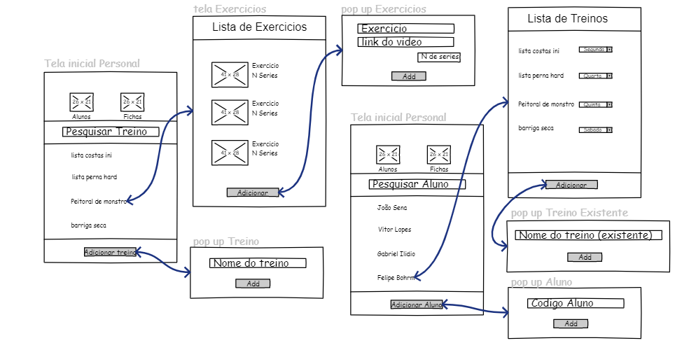

# Projeto de Interface
Visão geral da interação do usuário pelas telas do sistema e protótipo interativo das telas com as funcionalidades que fazem parte do sistema (wireframes).

## Diagrama de Fluxo

O diagrama a seguir mostra o fluxo da interação do usuário com o sistema, tal como a interconexão entre telas e ações disponíveis.

## Wireframes

Estes são os WireFrames do Usuário com o fluxo de cada tela.

Estes são os WireFrames do Personal com o fluxo de cada tela.
 
