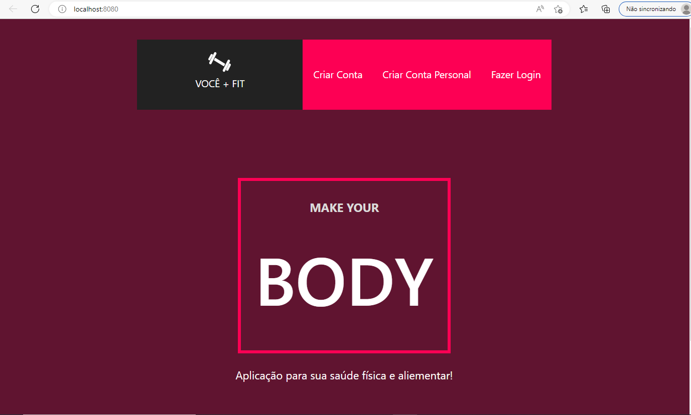
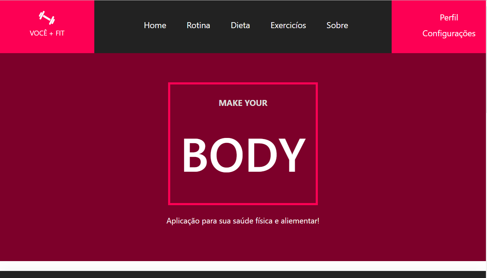
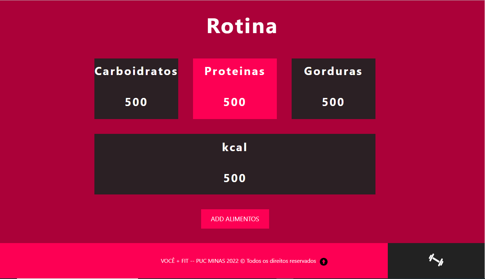
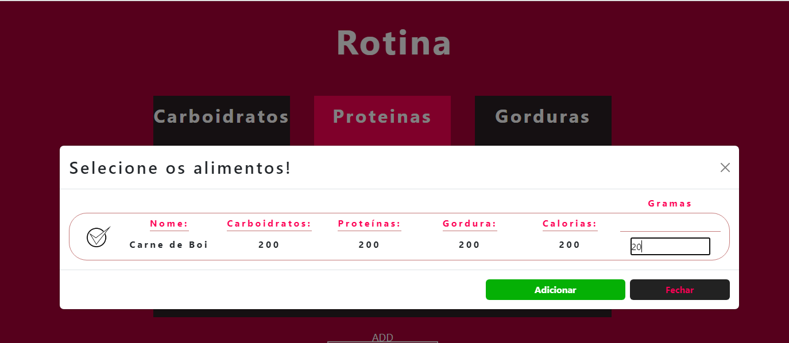

# Registro de Testes de Software

Relatório com as evidências dos testes de software realizados no sistema pela equipe, baseado em um plano de testes pré-definido.

|Caso de Teste | CT-01 - Funcionamento da API(Application Programming Interface) para os usuários.|
|:--|:--|
|**Objetivo do teste**|Verificar e testar o cadastro dos usuários juntamente com outras funcionalidades CRUD(Create, Read, Update, Delete).|
|**Resultado**|O usuário consgue cadastrar, alterar e excluir seus dados com sucesso, a aplicação exibe os dados do usuário com sucesso.|
>Aqui vem img mostrando o resultado

|Caso de Teste | CT-02 - Funcionamento da interface do usuário(não logado) com os funcionamentos do lado do servidor.|
|:--|:--|
|**Objetivo do teste**|Verificar se o usuário não logado terá o acesso primário a aplicação, dando-lhe a opção de realizar o login ou a criação de conta como aluno ou treinador, conforme o usuário deseje.|
|**Resultado**|O usuário não logado consegue acessar a aplicação com restrições até que logue, as opções para realizar o cadastro e login são exibidas com sucesso.|

|Caso de Teste | CT-03 - Funcionamento da interface do usuário(logado) com os funcionamentos do lado do servidor.|
|:--|:--|
|**Objetivo do teste**|Verificar o funcionamento da aplicação para usuários já logados e as funcionalidades que o usuário poderá realizar, utilizando o lado do cliente e do servidor.|
|**Resultado**|O usuáio logado consegue verificar, incluir, alterar e apagar informações para o funcionamento e uso da aplicação com sucesso.|

## Avaliação

A maior parte das funcionabilidades estão corretas de acordo com a documentação. Algumas funcionalidades extras foram criadas mas ainda existem possibilidades para melhorias.