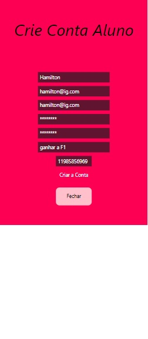

# Registro de Testes de Usabilidade

Relatório com as evidências dos testes de software realizados no sistema pela equipe, baseado em um plano de testes pré-definido.

|Caso de Teste | CT-01 - Responsividade|
|:--|:--|
|**Objetivo do teste**| O usuário deverá acessar a página tanto em um desktop quanto em um mobile para testar a responsividade de todo conteúdo|
|**Resultado**|O conteúdo do site está responsivo.|

|Caso de Teste | CT-02 - Funcionamento da apliação Mobile|
|:--|:--|
|**Objetivo do teste**| O usuario deverá acessar a aplicação Mobile com êxito.|
|**Resultado**|O usuário consegue acessar a aplicação Mobile com êxito e sem quebras ou mau funcionamento.|

|Caso de Teste | CT-03 - Realizar Cadastro|
|:--|:--|
|**Objetivo do teste**|O usuario deverá se cadastrar para acessar todas as funcionalidades da aplicação.|
|**Resultado**|O usuário consegue acessar a aplicação com restrições de acesso caso não logado, após logado o usuário possui acesso a todas as funcionalidades.|

|Caso de Teste | CT-04 - Links direcionaveis|
|:--|:--|
|**Objetivo do teste**|Verificar o redirencionamento dos links disponiveis no site.|
|**Resultado**|O usuário consegue acessar todos os links que estão presentes na aplicação, sendo direcionado para as URLs corretamente.|

|Caso de Teste | CT-05 - Manipular dados necesários para o funcionamento da aplicação.|
|:--|:--|
|**Objetivo do teste**|O usuário deverá conseguir adicionar e manipular os dados necessários para que a aplicação funcione corretamente, sendo barrado caso algum dado esteja incorreto através de validações.|
|**Resultado**|O usuário consegue adicionar, alterar, excluir e a aplicação está exibindo os dados com sucesso.|
> Exemplo de melhoria    =>    |**Melhoria**|Aqui vem a melhoria a ser feita|

|Caso de Teste | CT-06 - Contatar os desensenvolvedores|
|:--|:--|
|**Objetivo do teste**|O usuário deverá poder se comunicar com os desenvolvedores através de formulário de email ou de suas redes sociais profissionais.|
|**Resultado**|Usuário consegue contatar os desenvolvedores.|

## Imagens

Clicando na opção de Registrar no Login o usuário e redirecionado para a tela perguntando se deseja criar uma conta para Aluno ou Treinador  
 
Clicando em uma das Opções irá aparecer os dados para preenchimento após preenchimento dos dados o Usuário poderá criar sua conta.  
 
Em seguida será redirecionado para a tela, para que o Usuario possa estar Logando com seu email e Senha 
 
Página principal com informações do usuário após logar  
 
Página Usuário para alteração de dados(Os dados já são buscados da API para mostrar ao usuário) 
 
Página para adicionar alimentos, quando o usuário digita o nome do alimento a busca pelos valores nutricionais acontece automaticamente.
 
Apertando em Dieta o usuário consegue ver os alimentos já cadastrado e o dia de cadastro  
 
Na opção de Exercícios irá ser exibido todos os exercicios já cadastrados para o aluno, também é conectado a uma API para buscar de forma automatica o vídeo no Youtube sobre o exercício e retornado a URL do vídeo  
  
Clicando na opção de Adicionar será exibido a tela para o usuário adicionar um novo exercício  
 
Clicando na opção de Adicionar Academia, será redirecionado para a tela listando todas as academias já registradas na aplicação por todos os usuários e o usuário poderá adicionar uma nova caso deseje.  
 
O usuário também poderá logar com o Google caso deseje, apertando em Login com o Google na página de Login. Após clicar na opção para Login com o Google e escolher o Gmail que deseja logar, será redirecionado para a tela onde poderá estar completando o seu cadastro com os dados que a aplicação exige, como o usuário logou com o Google já terá algumas informações como o Nome, Email e a Senha. 
 
Após editar os dados o usuário logado pelo Google será redirecionado para a página principal, onde poderá usar a aplicação normalmente  

## Avaliação

A maior parte das funcionabilidades estão corretas de acordo com a documentação. Algumas funcionalidades extras foram criadas mas ainda existem possibilidades para melhorias e atualizações.