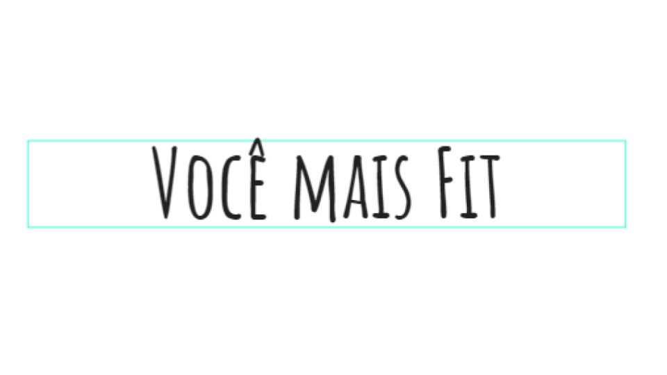
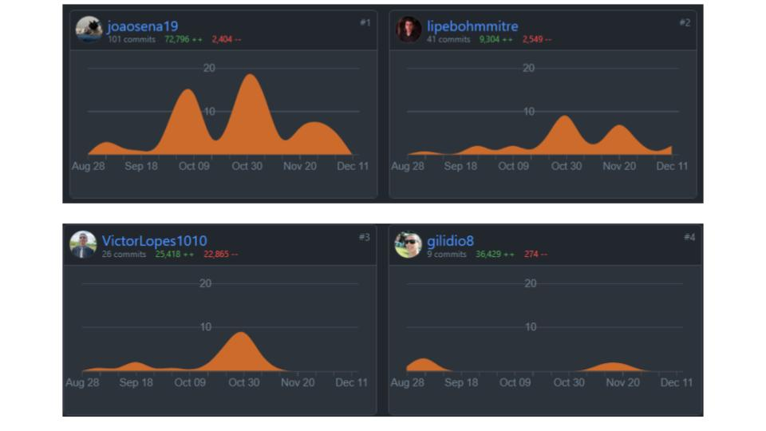
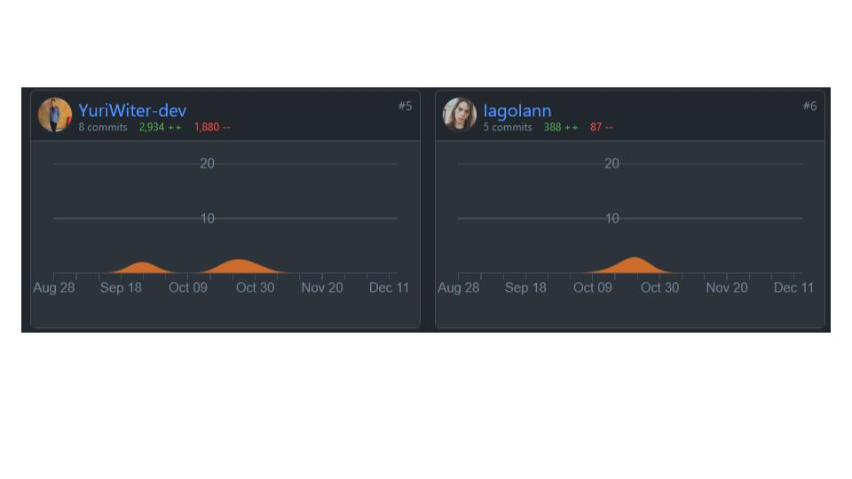
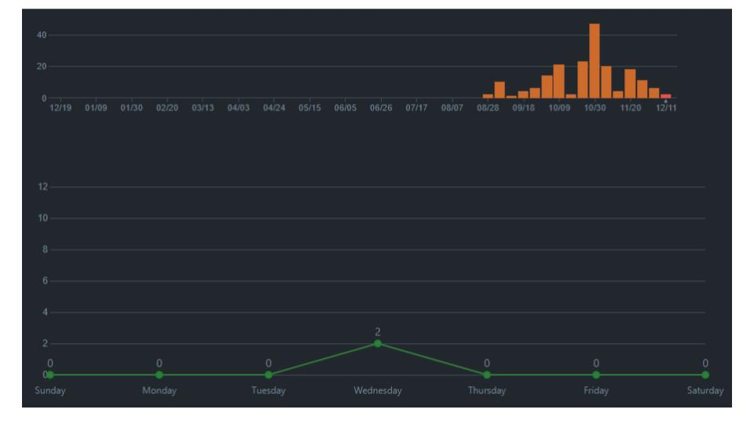

# Apresentação

## Título do Projeto

### Voce Mais Fit  

## Identidade Visual (Marca, Design)

## Conjunto de Slides (Estrutura)

[Slide Apresentação](img/apresentacao/Voce%20Mais%20Fit.pdf)

## Tecnologias Utilizadas:
 

|<h3>**Back-End / Api**</h3> |  ||
| ------------------------------------------------------- | -------------------| ---------|
|[Node.Js](https://nodejs.org/en/docs/)| Node.Js é uma Tecnologia usada para executar código JavaScript fora do navegador. Com ele podemos construir aplicações web em geral, desde web sites até APIs e microsserviços. Isso é possível graças a união do ambiente de execução de JavaScript fornecido pelo próprio Node. 
[Express Js](https://expressjs.com/pt-br/)| O Express é um framework utilizado em conjunto com o Node. js. Ele possui características que facilitam o desenvolvimento de nossas aplicações web e APIs, como um sistema de rotas completo, tratamento de exceções, gerenciamento de requisições HTTP e muito mais.
[Nodemon](https://nodemon.io/)| O nodemon é uma biblioteca que ajuda no desenvolvimento de sistemas com o Node. js reiniciando automaticamente o servidor.
[Mongoose](https://mongoosejs.com/)|  Mongoose é um biblioteca de Modelagem de Dados de Objeto para MongoDB e Node.js. Ele gerencia o relacionamento entre dados, fornece a validação de esquemas e é usado como tradutor entre objetos no código e a representação desses objetos no MongoDB.
[Jest](https://jestjs.io/pt-BR/)| Jest é uma estrutura de teste JavaScript construída em cima do Jasmine e mantida pela Meta. Ele foi projetado e construído por Christoph Nakazawa com foco na simplicidade e suporte para grandes aplicativos da web. Trabalha com projetos usando Babel, TypeScript, Node.js, React, Angular, Vue.js e Svelte.
| |  |  |
 

|<h3>**Banco de Dados**</h3> |  ||
| ------------------------------------------------------- | -------------------| ---------|
|[MongoDB Atlas](https://www.mongodb.com/atlas/database)| O MongoDB Atlas oferece aos clientes um serviço totalmente gerenciado na infraestrutura confiável e globalmente escalonável do Google. Com o Atlas, você gerencia bancos de dados de maneira simples, com apenas alguns cliques na IU ou ao chamar a API.
| |  |  |
 

|<h3>**Front-End / Web**</h3> |  ||
| ------------------------------------------------------- | -------------------| ---------|
|[Bootstrap](https://getbootstrap.com/)| Bootstrap é um framework front-end que fornece estruturas de CSS para a criação de sites e aplicações responsivas de forma rápida e simples.
[Vue js](https://vuejs.org/)| O Vue. js é um framework Javascript open source bastante conhecido pela sua reatividade. Usado para construir SPA (Single Page Applications) e interfaces de usuário, tornou-se uma excelente opção, também, pelo fato de ter componentes reutilizáveis e proporcionar o desenvolvimento ágil.
| |  |  |
 

|<h3>**Mobile**</h3> |  ||
| ------------------------------------------------------- | -------------------| ---------|
|[React-Native](https://reactnative.dev/)| React-Native é uma estrutura de aplicativo móvel popular, baseada na linguagem JavaScript, que permite criar aplicativos móveis renderizados nativamente para iOS e Android. A estrutura permite criar um aplicativo para várias plataformas usando a mesma base de código.
| |  |  |
 

## Propostas de Melhorias
 

- Proposta #1: A aplicação poderá ser totalmente hospedada, no momento apenas o Banco de Dados está hospedado em Servidor, no futuro poderá ter a aplicação Web e Mobile também hospedadas em Servidores.
- Proposta #2: A parte Mobile da aplicação não contem todas as funcionalidades detalhadas com exatidão comparado a Web, no futuro poderá ser atualizadas e melhoradas.
- Proposta #3: Foi utilizado uma API para a busca dos valores nutricionais com base no nome do alimento fornecido pelo usuário de forma automatica, porém esta API apenas busca por produtos em Ingles, sendo necessário consumir outra API antes para que possa traduzir o nome do alimento, este processo deixa a busca de forma lenta, no futuro poderá ser melhorado para que tenha um melhor desempenho.
- Proposta #4: No futuro poderá ter uma melhor cobertura de testes automatizados.
   

## Gestão de Trabalho do Time pelo GitHub
 

 
Grafico da Frequencia de Códigos
 
Grafico dos Commits

 

## Responsabilidades/Atribuições dos Membros do Time

Tendo em vista os papéis do Scrum a equipe foi organizada da seguinte maneira:

- Scrum Master: João Sena
- Product Owner: Gabriel Ilídio
- Equipe de desenvolvimento:
    - Felipe Bohm
    - Gabriel Ilídio
    - Iann Iago
    - João Sena
    - Victor Lopes
    - Yuri Witter
- Equipe de UX Design:
    - Iago Iann
  

